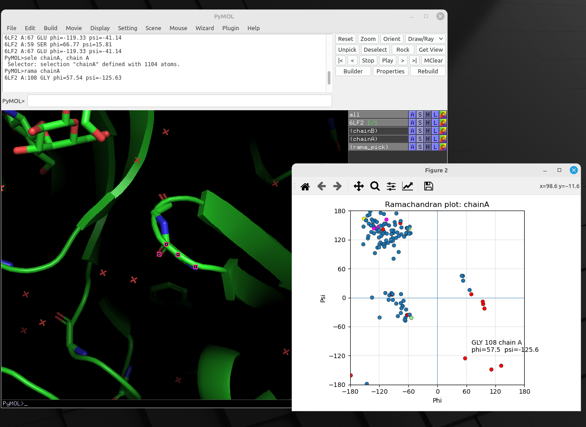

# pymol-rama
PyMOL Ramachandran Plot

A small PyMOL utility for plotting phi/psi angles for a selected set of residues.

Features:
- clickable Ramachandran plot
- clicking a point selects the corresponding residue in PyMOL
- special colouring for Gly, Pro, Cys and Trp
- works on arbitrary PyMOL selections

  
Usage:

run rama.py  
select test, chain A and resi 100-200  
rama test

Requires:
- PyMOL
- matplotlib
